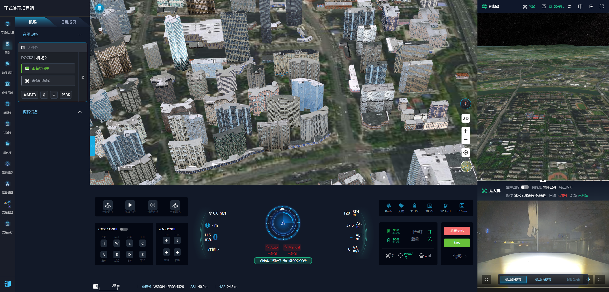
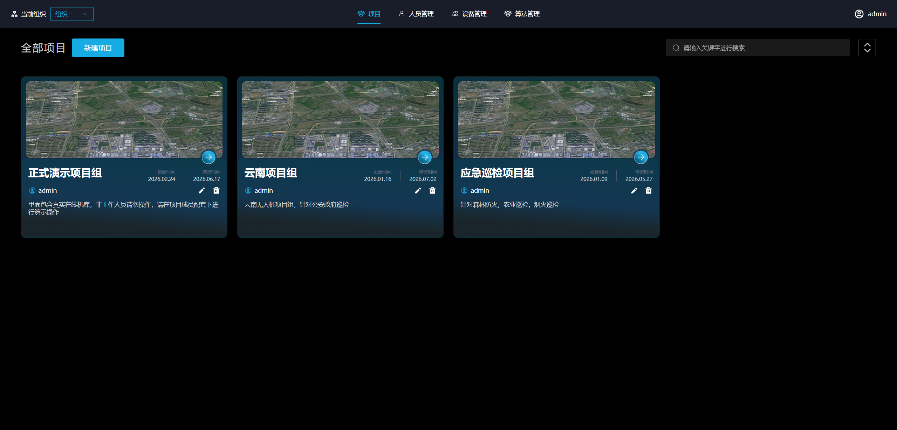
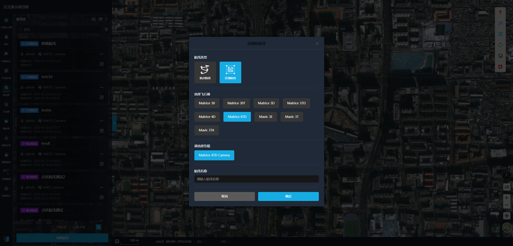
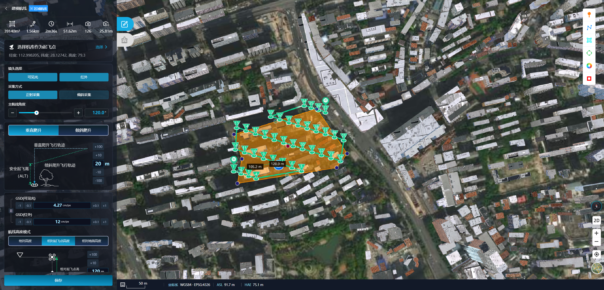
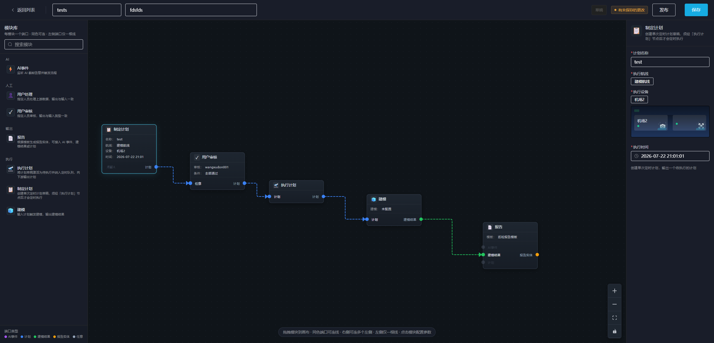

# 无人机云平台 · 企业级无人机云解决方案

> 与司空同架构的私有化无人机云平台 —— 全系列机场接入、专业航线规划、AI 实时识别、一键三维建模，开箱即用，可按需扩展。

---

## 系统部分预览

   
  平台总览 · 三维建模、机场管控、实时画面

   
  项目管理 · 多行业项目组统一纳管

  
  &nbsp;
   
  航线规划 · 航点航线 / 区域航线，正射与倾斜采集

  
  &nbsp;
   
  智能航线与飞行区 · AI 算法配置、作业区 / 禁飞区管理

   
  模块化工作流 · 计划、审核、执行、建模、报告一键编排

---

## 合作优势

| | |
|:---:|:---|
| 💰 **价格优惠** | 同等司空级能力，**采购成本显著低于市场同类产品**。支持按需选配模块，避免为不需要的功能买单，政企客户可享专属优惠方案。 |
| 🌐 **在线试用** | 提供**完整功能的在线演示环境**，注册即可体验设备管理、航线规划、建模、AI 识别等核心能力，**所见即所得，先试后买**。 |
| 📂 **源码可查** | 采购前可申请**源码查阅**，代码规范、架构清晰、注释完善，**技术团队可提前评估可维护性与扩展性**，降低决策风险。 |
| ✅ **案例丰富** | 已在**测绘、公安、应急、农林**等多个行业落地，**成交项目众多**，经过大量真实场景验证，交付经验丰富、售后有保障。 |

> **立即体验：** 如需在线试用地址、源码查阅权限或报价方案，请通过文末联系方式与我们联系。

---

## 为什么选择我们？

面向政企、能源、测绘、应急等行业客户，提供与 **大疆司空** 同等能力的无人机云管理能力。平台架构清晰、模块解耦，既支持 **源码交付** 与 **私有化部署**，也便于二次开发与长期运维接手。

  

---

## 核心能力

### 全机型统一接入

- 支持 **大疆全系列机场**（Dock 系列）统一纳管
- 支持 **单兵无人机** 灵活接入，空地一体协同作业
- 设备状态、任务调度、飞行数据集中管控

  

### 专业航线规划

与司空 **完全一致** 的航线算法引擎，覆盖主流作业场景：

| 航线类型 | 适用场景 |
|---------|---------|
| 点状航线 | 定点巡检、目标环绕 |
| 正射航线 | 二维正射影像采集 |
| 倾斜摄影航线 | 三维实景建模数据采集 |

  
  &nbsp;
  

### 飞行结果一键建模

- 平台 **内置建模能力**，飞行任务完成后可一键发起重建
- 三维模型自动加载至地图，直接用于 **航线规划、态势研判** 等下游场景
- 打通「飞 → 建 → 用」完整业务闭环

### AI 实时识别与告警

- 无人机画面 **实时 AI 识别**，识别结果叠加显示于直播画面
- 航线任务中可 **配置识别算法**，飞行过程中自动触发检测
- 识别异常 **实时告警**，支撑巡检、安防、应急等场景的即时响应

  

### 模块化业务流

- 内置多种 **业务模块**，覆盖常见无人机作业流程
- 支持 **按需扩展** 与自定义模块，灵活组装工作流
- 避免重复造轮子，显著降低业务开发成本

  

---

## 交付方式

| 方式 | 说明 |
|-----|------|
| **源码交付** | 完整源代码开放，支持采购前查阅，便于深度定制与技术审计 |
| **私有化部署** | 部署于客户内网或专有云，数据自主可控 |
| **在线试用** | 提供演示环境，核心功能完整可用，降低选型成本 |

代码规范、架构分层清晰、文档完善，**降低接手与二次开发门槛**。

---

## 技术亮点

- **同构架构** —— 与司空对齐的云平台架构，成熟可靠
- **算法一致** —— 航线规划算法与司空保持同步，作业成果可预期
- **端到端闭环** —— 接入 → 规划 → 飞行 → 建模 → 识别 → 告警，一站完成
- **模块可插拔** —— 业务流按需组装，扩展而不重构

---

## 适用场景

测绘勘察 · 电力巡检 · 园区安防 · 应急救援 · 智慧工地 · 农林植保

---

## 联系我们

| 需求 | 说明 |
|-----|------|
| **在线试用** | 获取演示环境地址与账号 |
| **源码查阅** | 申请源码预览，技术团队提前评估 |
| **报价咨询** | 获取优惠方案与模块选配建议 |
| **私有化部署** | 沟通部署架构与交付周期 |

欢迎通过 **Issue 留言** 或 **邮件** 与我们联系。

<!-- 替换为实际联系方式 -->
<!-- 邮箱：your-email@example.com -->
<!-- 试用地址：https://demo.example.com -->

---
